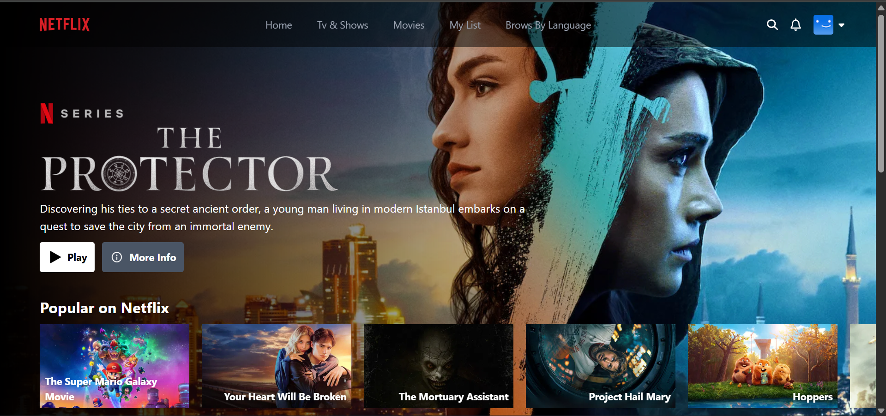

# Netflix Clone 🍿



A modern, full-stack web application replicating the core features and design of Netflix. Built with React, TypeScript, Vite, and powered by Firebase Authentication.

## 🚀 Live Demo

[View Live Demo Here](https://mujthabasalim.vercel.app/)

## 🛠️ Built With

- **Frontend Framework:** React (with TypeScript)
- **Tooling:** Vite
- **Styling:** TailwindCSS
- **Authentication:** Firebase Auth (Email/Password)
- **Database/Backend:** Firebase / TMDB API

## ✨ Key Features

- **User Authentication:** Secure signup/login flow using Firebase.
- **Protected Routes:** Only authenticated users can access the content.
- **Dynamic Content:** Fetches and displays movies/shows beautifully in carousels.
- **Responsive Design:** Fully responsive UI, optimized for mobile and desktop viewing.

## 💻 Getting Started Locally

To get a local copy up and running, follow these simple steps.

### Prerequisites

- Node.js (v16 or higher)
- npm or yarn
- Firebase Account

### Installation

1. **Clone the repository**

   ```bash
   git clone https://github.com/mujthabasalim/netflix-clone.git
   ```

2. **Install dependencies**

   ```bash
   cd netflix-clone/client
   npm install
   ```

3. **Setup Environment Variables**
   Create a `.env` file in the `client` directory and add your Firebase credentials:

   ```env
   VITE_FIREBASE_API_KEY=your_api_key
   VITE_FIREBASE_AUTH_DOMAIN=your_auth_domain
   VITE_FIREBASE_PROJECT_ID=your_project_id
   VITE_FIREBASE_STORAGE_BUCKET=your_storage_bucket
   VITE_FIREBASE_MESSAGING_SENDER_ID=your_messaging_sender_id
   VITE_FIREBASE_APP_ID=your_app_id
   ```

4. **Run the development server**
   ```bash
   npm run dev
   ```

## 🔐 Security Note

**Never commit your `.env` file to GitHub.**
The `.gitignore` in this project has been configured to ignore `.env` files to keep your API keys secure.

## 👨‍💻 Author

- Mujthaba Salim - [@mujthabasalim](https://github.com/mujthabasalim)
- Portfolio - [mujthabasalim](https://mujthabasalim.vercel.app)
